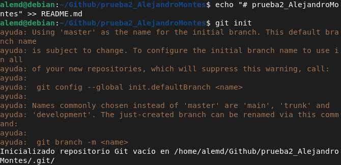

# prueba2_AlejandroMontes
## Taller 2: Introducción a Markdown

**Lorem ipsum** dolor sit amet, consectetur adipiscing elit. In tincidunt, sem id euismod
rhoncus, nibh massa dapibus tellus, eu consectetur purus _nunc_ quis orci. Duis rhoncus
neque ac sollicitudin ornare. Quisque iaculis nisl nec commodo hendrerit. ***Mauris*** tem
semper finibus. Nulla id ipsum quis est interdum luctus ut in eros. Proin sagittis libero
vel orci hendrerit, at blandit odio rhoncus. __Pellentesque__ quis mi sapien. Mauris et
vestibulum lacus. Curabitur ut facilisis felis, eu dapibus leo. Aenean ut elit iaculis,
porta leo sit amet, feugiat elit. Orci varius natoque penatibus et magnis dis parturient
montes, nascetur ridiculus mus. Sed bibendum turpis mollis, mattis ante aliquet, eleifend
turpis. 
>_Praesent feugiat risus dui, ac iaculis libero pulvinar eget.- Pablo coelho_
<pre>    
quien=$(whoami)
function f_soyroot {
if [[ $quien = "root" ]]
    then
        return 0
    else
        return 1
fi
}
function f_hayinternet {
if [[ $(ping -c 1 8.8.8.8) ]]
    then
        return 0
    else
        return 1
fi
}
function f_ipvalidator {
if [[ $1 =~ ^([0-9]{1,3}\.){3}[0-9]{1,3}$ ]]
    then
        return 0
    else
        return 1
fi
}
</pre>
**LISTA ORDENADA**
1. IAW
2. SAD
3. SRI
4. EMP
5. ASO
6. HLC
7. BD

**LISTA DESORDENADA**
* GGGGG
    + ddddd
    + ffffff
    + qqqqqq
    + vsdvvd
* vvvvvv
* vvvvvv
* vvvvvvv

**ENLACE**

Esto es un enlace a [Google](https://google.com) y esto es un enlace a [README2.md](./README2.md)

**IMAGEN**

**TABLA**
| PRIMERA COLUMNA | SEGUNDA COLUMNA | TERCERA COLUMNA |
| -- | -- | -- |
| UNO | DOS | TRES |
| CUATRO | CINCO | SEIS |
